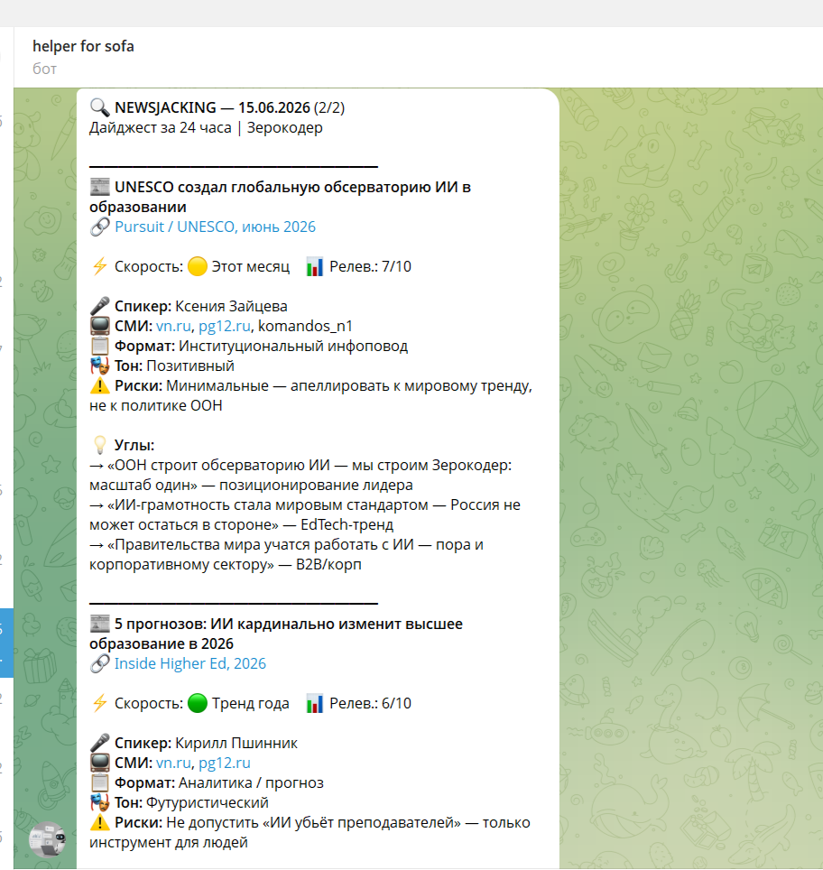
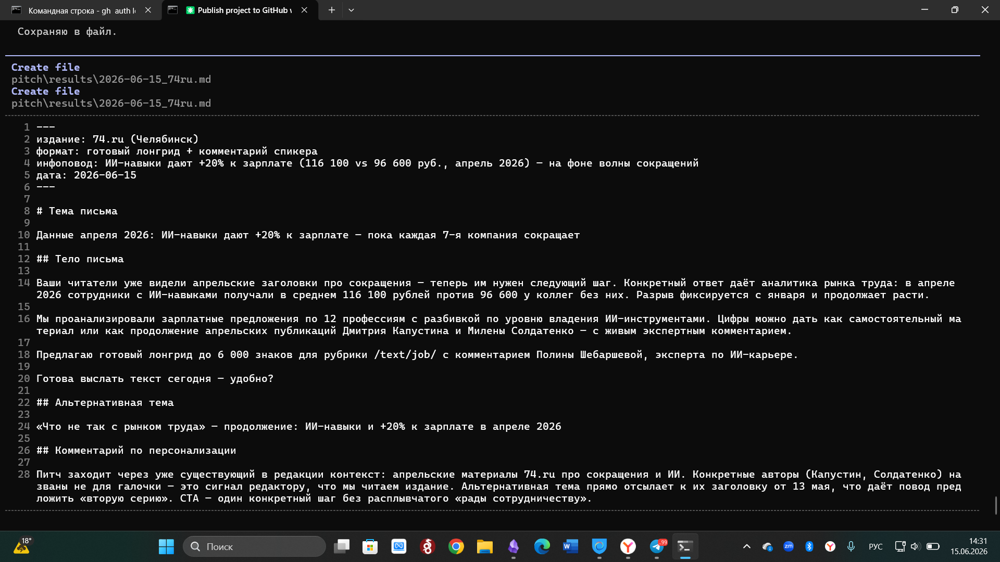
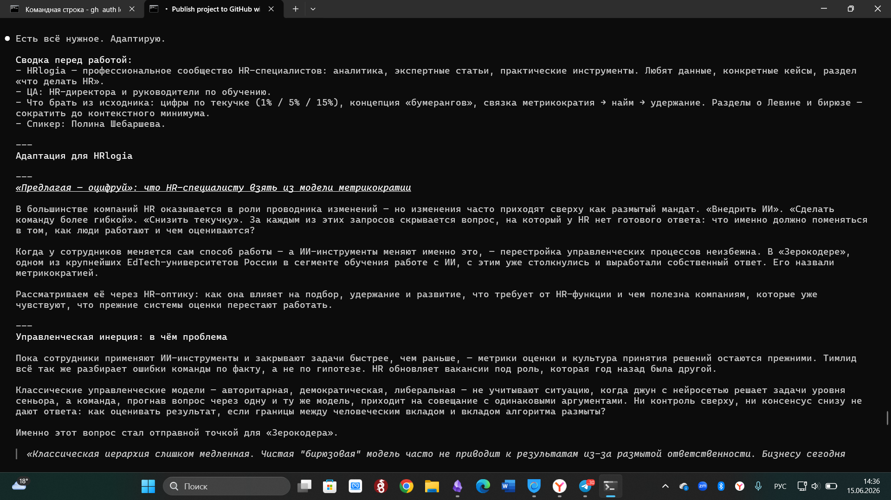
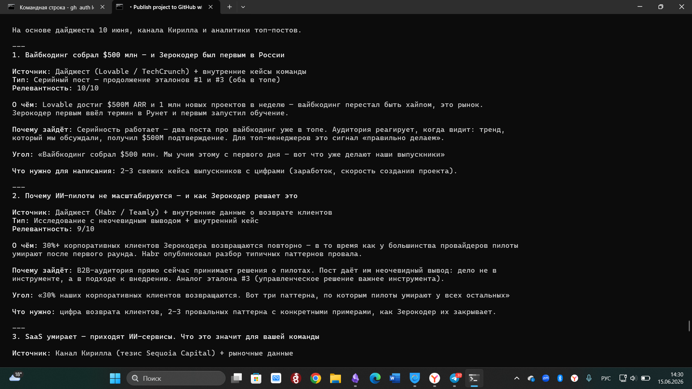
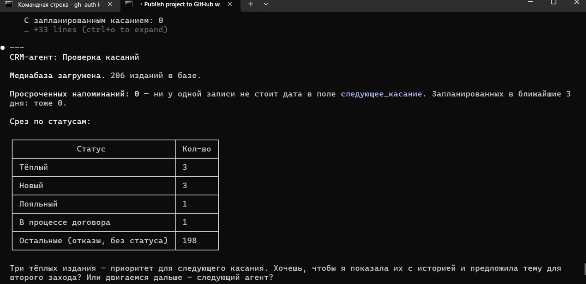
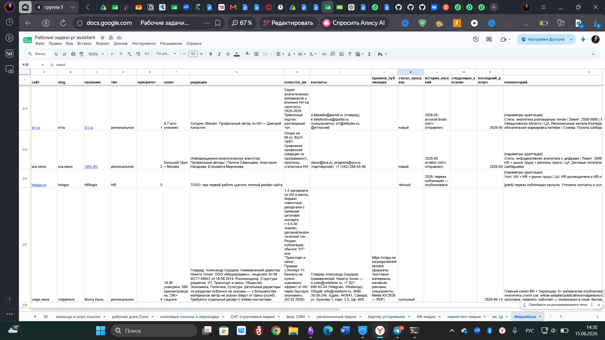

# PR-Helper — Мультиагент PR-цикла Зерокодера

Система из пяти специализированных ИИ-агентов для автоматизации регулярного PR-цикла онлайн-школы. Заменяет ручную работу PR-менеджера с медиа: мониторинг → питч → адаптация статьи → публикация → CRM.

---

## Проблема

PR в медиа — это ежедневная рутина: мониторить инфоповоды, предлагать темы редакторам, адаптировать материалы под каждое издание, вести историю касаний и не забывать про второе касание через неделю. Всё это отнимает время, требует переключения между инструментами и легко выпадает из фокуса.

PR-Helper автоматизирует весь цикл — от ежедневного дайджеста медиаполя до фиксации касания в CRM после отправки питча.

---

## Пользователь

**Соня** — PR-менеджер компании «Зерокодер» (онлайн-университет по обучению ИИ). Работает с региональными деловыми медиа, HR-изданиями и СМИ СНГ. Пишет статьи на тему ИИ для неспециализированной аудитории, ведёт бартерное сотрудничество с редакциями, наполняет B2B-Telegram-канал.

---

## Основная функция

Пять агентов, каждый закрывает свой участок PR-цикла:

| Агент              | Что делает                                                                                             |
| ------------------ | ------------------------------------------------------------------------------------------------------ |
| **Ньюсджекер**     | Ежедневный автоматический мониторинг медиаполя (10:00 МСК) → дайджест 5-10 инфоповодов с углами подачи |
| **Питч-мейкер**    | Три субагента по конвейеру: ресёрч площадки → стратегический анализ → готовый питч для редактора       |
| **Адаптер статей** | Берёт готовый материал и адаптирует под конкретное издание: стиль, длина, угол, рубрика, ЦА            |
| **B2B-чат**        | Создаёт посты для закрытого Telegram-канала для топ-менеджеров — из инфоповода или по выбранной теме   |
| **CRM-агент**      | Ведёт медиабазу (205 изданий), отслеживает статусы касаний, напоминает о втором и третьем касании      |

Агенты связаны через единую Google Sheets («Медиабаза») и общую базу контекста о бренде (`shared/zerocoder-context.md`).

---

## Формат результата

В зависимости от агента пользователь получает:

- **Ньюсджекер** → Telegram-сообщение: 4-5 инфоповодов с заголовком, контекстом и 3 углами подачи для питча
 
- **Питч-мейкер** → `.md`-файл: питч с обоснованием темы, тезисами, рекомендациями по отправке
 
- **Адаптер** → `.md`-файл: переработанная статья под конкретное издание + список изменений
 
- **B2B-чат** → `.md` + `.json`: готовый пост в формате Telegram + метаданные
 
- **CRM** → Список изданий с просроченными касаниями + возможность обновить статусы одной командой

 

---

## Функционал

- Автоматический ежедневный дайджест медиаполя в Telegram
- Создание питча через конвейер трёх субагентов
- Адаптация статьи под 6 целевых изданий (vn.ru, 74.ru, e1.ru, ura.news, T-Business, hrlogi.ru)
- Генерация постов для B2B Telegram-канала
- Единая медиабаза в Google Sheets с историей касаний и напоминаниями
- Shared Python-библиотека `sheets.py` — единая точка доступа к CRM для всех агентов

---

## Технологии

| Слой | Инструменты |
|---|---|
| **Оркестрация агентов** | Claude Code (CLAUDE.md, Skills, Sub-agents) |
| **Языки** | Python 3, Markdown |
| **Интеграции** | Google Sheets API (gspread), Telegram Bot API |
| **Поиск и парсинг** | WebFetch, WebSearch, Brave Search MCP, Jina |
| **Автоматизация** | Claude Cloud Routines (cron-триггер для ньюсджекера) |
| **Хранение данных** | Google Sheets (205 изданий, 15 колонок), Markdown-файлы |
| **Среда разработки** | Zed, Obsidian |

---

## Структура проекта

```
pr-helper/
├── shared/
│   └── zerocoder-context.md        ← единая база контекста о бренде (для всех агентов)
├── newsjacking/                    ← ежедневный мониторинг медиаполя
├── pitch/                          ← питчи в редакции (3 субагента)
├── article-adapter/                ← адаптация статей под издания
│   ├── promts/                     ← модульные промты (стиль, критерии, паттерны)
│   └── publications/               ← досье на 6 изданий
├── b2bchat/                        ← посты для Telegram B2B-канала
└── mediabase/                      ← CRM-агент + shared-библиотека sheets.py
```

---

## Поток данных

```
Ньюсджекер (авто 10:00 МСК)
    ↓
  Дайджест → Соня выбирает тему
    ↓
  ┌─────────────────────────────┐
  │                             │
  Питч-мейкер               B2B-чат
  (ресёрч → анализ → питч)  (пост в Telegram)
      ↓
  CRM фиксирует касание
      ↓
  Статья принята → Адаптер
      ↓
  B2B-чат анонсирует публикацию
```

---

## Запуск

### Зависимости

```bash
pip install gspread google-auth
```

### Google Sheets

1. Создать сервисный аккаунт в Google Cloud Console
2. Добавить `credentials.json` в `mediabase/` (не коммитится)
3. Дать аккаунту доступ к таблице «Медиабаза»

### Ньюсджекер

Автоматически запускается через Claude Cloud Routine по расписанию 10:00 МСК. Ручной запуск — скилл `manual-digest` в Claude Code.
